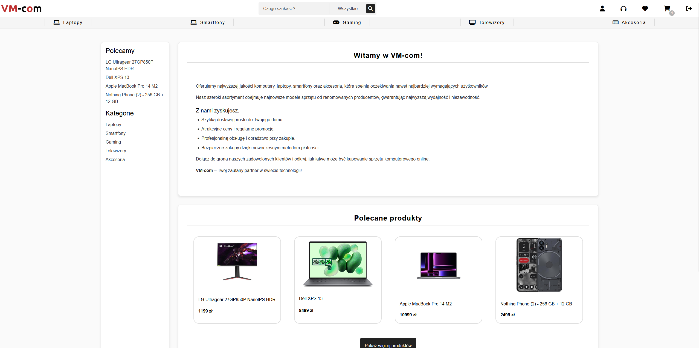
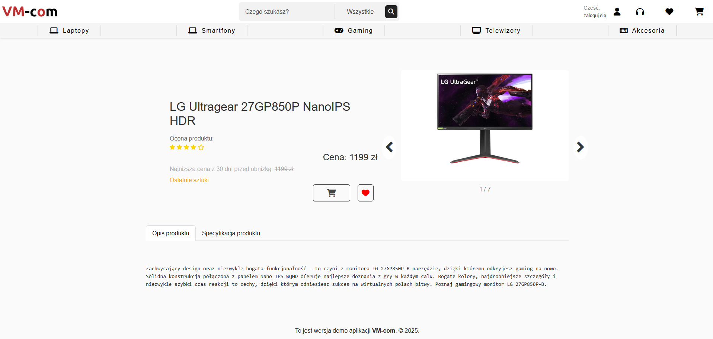
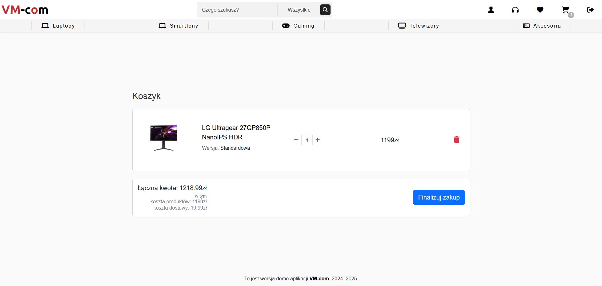

# VM-COM – Modern e-commerce solution

VM-COM is a modern e-commerce application that makes online shopping safe and easy.  
The project utilizes a robust and scalable technology stack, ensuring high performance and security.

On the backend, we use **Spring Boot**, known for its stability and enterprise-level security.  
The frontend is built with **Angular**, **TypeScript**, **Bootstrap**, and **SASS**, delivering a clean and responsive UI.

## 🔥 Features

✅ **Secure Authentication & Authorization** – Users can register, log in, and manage their accounts securely.  
✅ **Product Catalog with Filtering & Searching** – Easily browse products using dynamic search and category filters.  
✅ **Shopping Cart & Order Simulation** – Users can add products to the cart, but order finalization is disabled as this is a demo.  
✅ **Dockerized Deployment with Nginx** – Simplified and scalable deployment using containerized environments.

## 🚀 Live Demo

🔗 **Try it out here:** **[VM-COM Demo](https://vm-com.kubisiak.dev/)**

📝 _Note:_ This is a demo version. Some functionalities, such as order finalization, are disabled.

## 🛠 Tech Stack

### Backend

### Frontend

### Tools & Deployment

## 👥 Contributors

### Backend Development

### Frontend Development

## 🖼 Screenshots

### Home Page

### Product Page

### Shopping Cart

